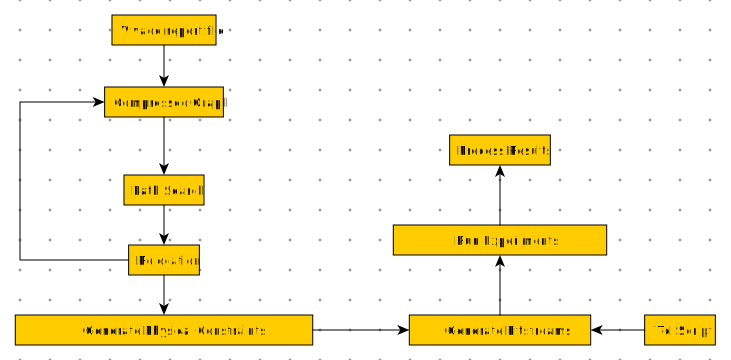

# Introduction


## arch_model_generator.py

```
usage: python3 arch_model_generator.py viv_rpt_path
```

## path_finder.py

```
usage: python3 path_finder.py device_name desired_tile iteration pips_mode
```

## relocate_CUTs.py

```
usage: python3 relocate_CUTs.py device_name desired_tile 
```

## constraint_generator.py

```
usage: python3 constraint_generator.py device_name 
```

## bitstream_generator.py

```
usage: python3 bitstream_generator.py 
```

## arch_graph_parser.py

```
usage: python3 arch_graph_parser.py device_name 
```